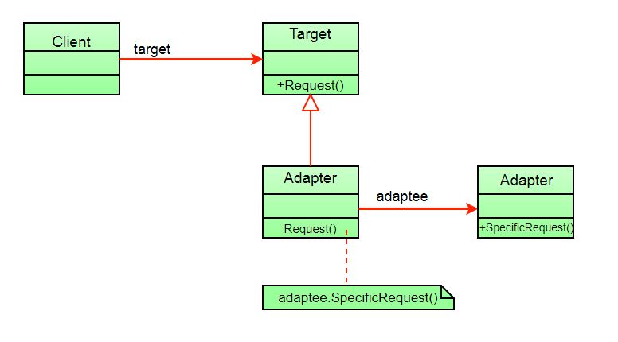

# Adapter Pattern

## Definition

Adapter pattern works as a bridge between two incompatible interfaces. This type of design pattern comes under structural pattern as this pattern combines the capability of two independent interfaces. This pattern involves a single class which is responsible to join functionalities of independent or incompatible interfaces. This pattern is easy to understand as the real world is full of adapters. For example consider a USB to Ethernet adapter. We need this when we have an Ethernet interface on one end and USB on the other. Since they are incompatible with each other. we use an adapter that converts one to other. This example is pretty analogous to Object Oriented Adapters. In design, adapters are used when we have a class (Client) expecting some type of object and we have an object (Adaptee) offering the same features but exposing a different interface.

## UML

## How to Implement

1. Make sure that you have at least two classes with incompatible interfaces:
   1. A useful service class, which you can’t change (often 3rd-party, legacy or with lots of existing dependencies).
   2. One or several client classes that would benefit from using the service class.
2. Declare the client interface and describe how clients communicate with the service.
3. Create the adapter class and make it follow the client interface. Leave all the methods empty for now.
4. Add a field to the adapter class to store a reference to the service object. The common practice is to initialize this field via the constructor, but sometimes it’s more convenient to pass it to the adapter when calling its methods.
5. One by one, implement all methods of the client interface in the adapter class. The adapter should delegate most of the real work to the service object, handling only the interface or data format conversion.
6. Clients should use the adapter via the client interface. This will let you change or extend the adapters without affecting the client code.
