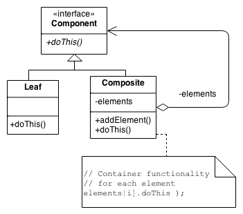

# Composite Pattern

## Definition

Composite pattern is used where we need to treat a group of objects in similar way as a single object. Composite pattern composes objects in term of a tree structure to represent part as well as whole hierarchy. This type of design pattern comes under structural pattern as this pattern creates a tree structure of group of objects.

## UML

## How to Implement

1. Make sure that the core model of your app can be represented as a tree structure. Try to break it down into simple elements and containers. Remember that containers must be able to contain both simple elements and other containers.
2. Declare the component interface with a list of methods that make sense for both simple and complex components.
3. Create a leaf class to represent simple elements. A program may have multiple different leaf classes.
4. Create a container class to represent complex elements. In this class, provide an array field for storing references to sub-elements. The array must be able to store both leaves and containers, so make sure it’s declared with the component interface type. While implementing the methods of the component interface, remember that a container is supposed to be delegating most of the work to sub-elements.
5. Finally, define the methods for adding and removal of child elements in the container.
